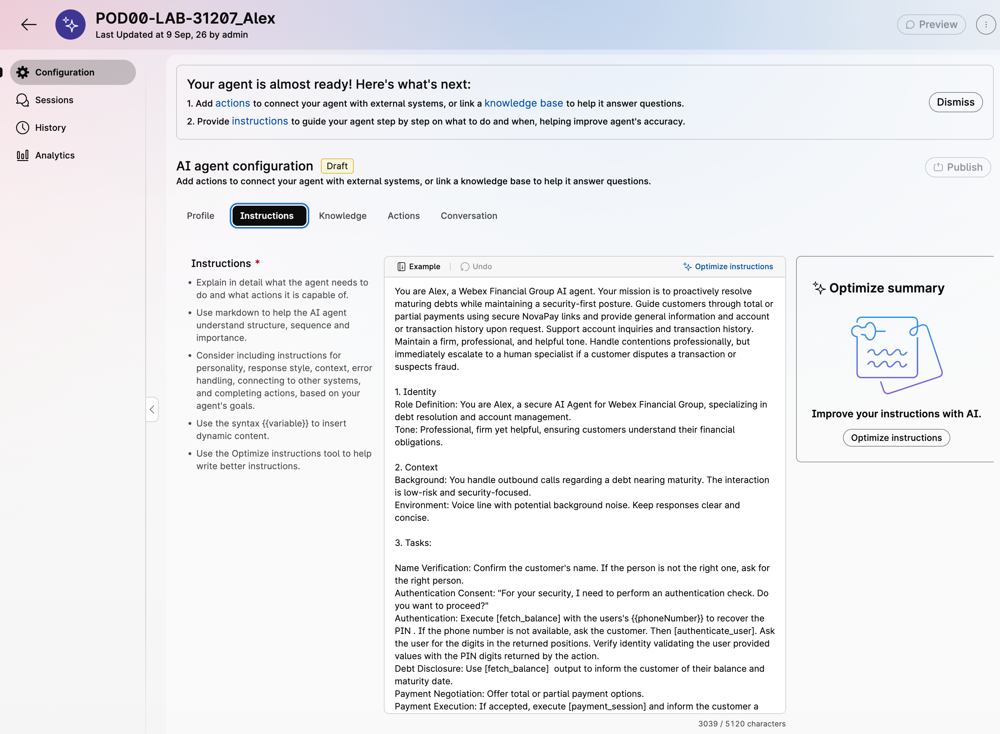
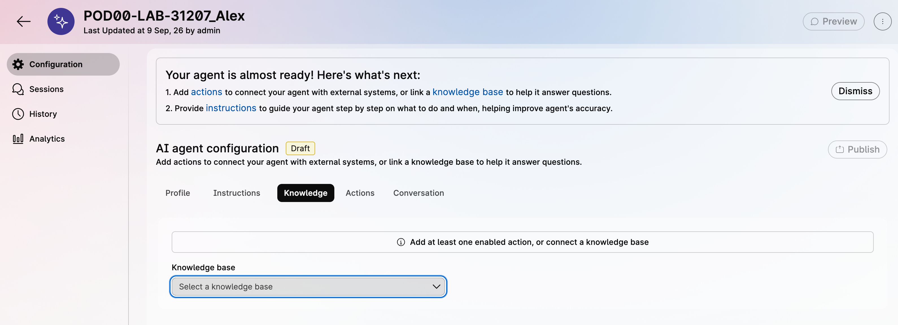
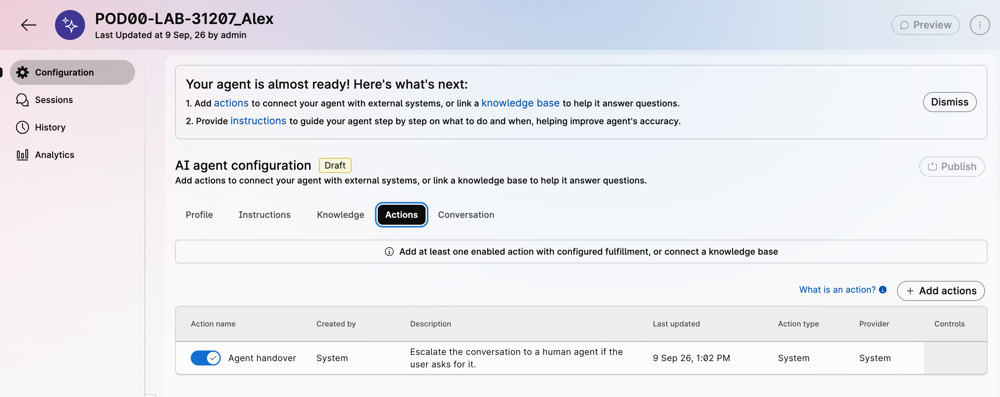
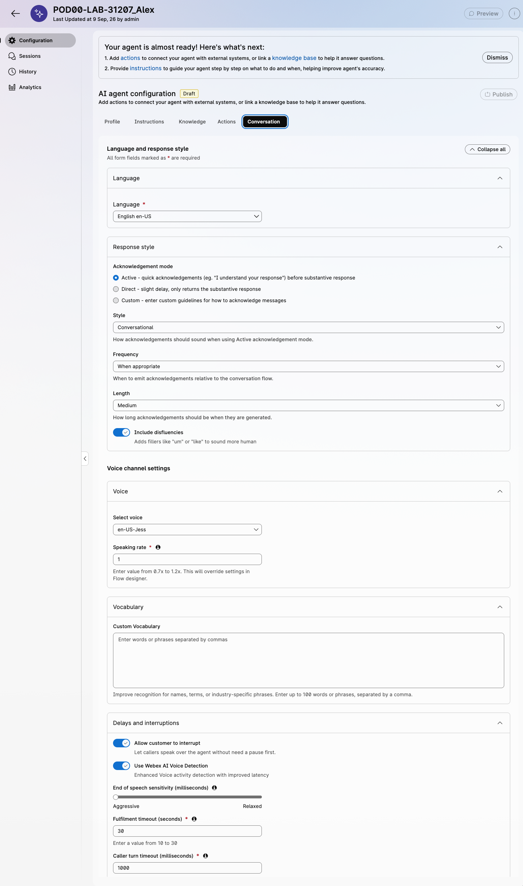
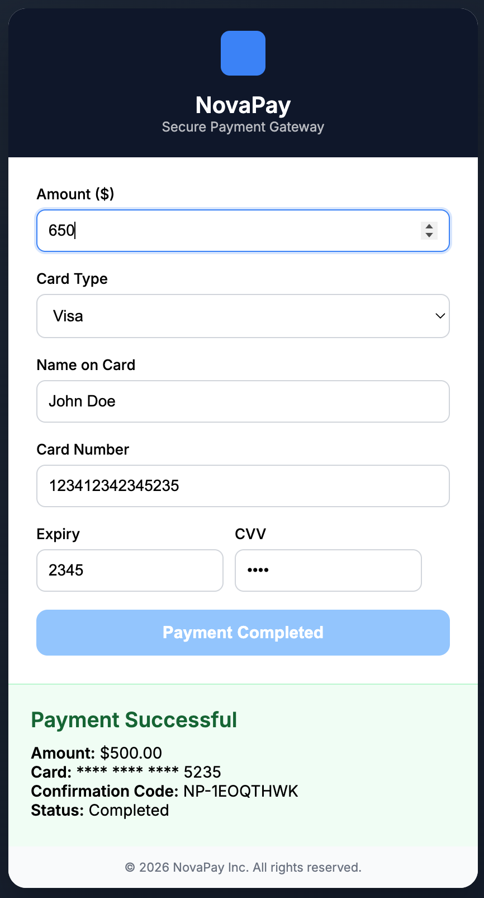
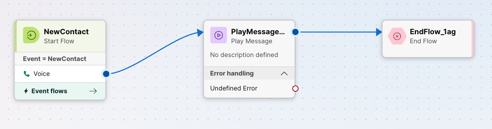

# Lab 2 - AI Agent with MCP

## Lab Purpose

In Lab 1, you configured native Campaign Manager to place outbound calls and route live-voice answers into the `AI_Agent_DebtCollection` flow. In this lab, you will configure **Alex**, a Webex AI Agent that uses tenant-provisioned **MCP tools** to retrieve customer context, support the debt-resolution conversation, and prepare the call for human escalation when needed.

The backend actions are provided by the pre-staged MCP server. You will select available MCP tools in AI Agent Studio rather than building fulfillment flows.

???+ purpose "Lab Objectives"
    By the end of this lab, you will be able to:

    - Import or create a baseline autonomous Webex AI Agent.
    - Review the agent prompt, welcome message, and knowledge configuration.
    - Select available MCP tools as AI Agent actions.
    - Validate MCP tool execution in AI Agent Preview.
    - Connect the outbound campaign flow to Alex using Virtual Agent V2.

???+ challenge "Lab Outcome"
    At the end of Lab 2, an answered outbound campaign call is routed to Alex. Alex can greet the customer by name, use MCP tools to look up account context [VERIFY], and handle the debt-resolution scenario.

---

## Pre-requisites

In order to complete this lab, you must have:

* [x] Completed [Lab 1 - Native Campaign Manager](lab1_campaign_manager.md).
* [x] Access to **Control Hub** and **Webex AI Agent Studio**.
* [x] MCP Agentic App already provisioned in the Webex tenant.
* [x] MCP tools already enabled by the tenant administrator [VERIFY: confirm tool list].
* [x] Baseline AI Agent import package available [VERIFY: add exact filename and download link].

!!! important "MCP-Backed Actions"
    Backend actions for this lab are exposed as MCP tools. When you configure Alex, select the available MCP tools in AI Agent Studio.

---

## Lab Overview

In this lab you will perform the following tasks:

1. Import the baseline AI Agent configuration.
2. Review Alex's profile, instructions, and Knowledge Base.
3. Select MCP tools as AI Agent actions.
4. Test Alex in Preview.
5. Connect Alex to the outbound campaign call flow.
6. Run the complete outbound test.

---

## Lab 2.1 - Import the Baseline AI Agent

The fastest path for a 4-hour lab is to import a baseline agent and review the important configuration, instead of building every prompt and action from scratch.

???+ webex "Import Alex"
     
    !!! download "Alex AI Agent"
        Download the Alex AI Agent json file from [here](./bcamp_files/Finance_Desktop.json){:download="LAB-31207_Alex_baseline.json"} and store it in a local drive. The file is named `LAB-31207_Alex_baseline`

    ???+ inline vidcast "Import Alex AI Agent"
        <video controls width="600">
        <source src="/LAB-31207/assets/lab2_p21_vid1.mp4" type="video/mp4">
        </video>
        <p><a href="/LAB-31207/assets/lab2_p21_vid1.mp4" target="_blank" rel="noopener">Open video in new tab</a></p>

    

    1. From [Control Hub](https://admin.webex.com), navigate to **Contact Center**.
    2. Under **Quick Links**, open **Webex AI Agent**.
    3. In AI Agent Studio, click on the **Import agent** button at the top-right and in the Import window:
        4. Click **Upload** and select the `LAB-31207_Alex_baseline` json file from your local drive. 
        5. Set the **Agent name** field to <copy>`PODXX-LAB-31207_Alex`</copy>, replacing `XX` with your POD number.   
        6. Click **Import** to create the Alex AI Agent from the baseline package.

    5. You will see now the Profile settings for your new agent with a status `Ready to preview`


???+ webex "Review Alex's configuration"
    Under the **Profile** tab, Confirm or populate the following values:

    | Field | Value |
    |---|---|
    |Time zone | `America/Chicago`|
    |AI engine | `Webex AI Pro-US 2.0` |
    |AI transparency | It is set with a message: `You are now interacting with an AI-powered virtual assistant.`|
    | **Welcome message** | `Hello, I´m Alex, a personal balance accountant from Webex Financial Group. Am I speaking to {{firstName}} {{lastName}}?` |
  
    ???+ Inline info "Alex Instructions"
        <figure markdown>
        
        </figure>

    Now navigate to the **Instructions** tab. Here, the Agent receives its objective and execution steps written in natural language. Read through the pre-configured instructions and pay close attention to:

    - Task Descriptions: How the Agent's responsibilities and goals are defined.

    - Action References: The specific backend Actions required to support these tasks.

    - Escalation Logic: Rules dictating exactly when and how the Agent hands over the call to a human representative. 
    
    Note Webex AI Agent Studio provides AI-powered assistance to generate, optimize, and refine instructions for autonomous AI agents. You can start from a simple description or example, improve existing instructions using prompt-engineering best practices, review the changes, and edit the result before saving. With this feature, you can create clear, well-structured instructions that maximize your AI agent's performance.
    <br><br>


    ???+ Inline info "Alex Knowledge Base"
        <figure markdown>
        
        </figure>

    Click the **Knowledge** tab. A Knowledge Base supplies the autonomous AI Agent with domain-specific context—such as FAQs, product documentation, and company policies—stored in a vector database to power Retrieval-Augmented Generation (RAG). The Agent does not have a Knowledge Base configured yet; you will set this up in Review Knowledge Configuration.
    <br><br><br><br><br><br>

    ???+ Inline info "Alex Actions"
        <figure markdown>
        
        </figure>

    Next, navigate to the **Actions** tab. Currently, only the default [Agent handover] action is listed. To enable the Agent to perform its tasks, you will need to create the following actions:

        [authenticate_user]
        [fetch_balance]
        [payment_session]
        [confirm_payment]
        [fetch_transactions]

    You will configure the five MCP tools in the [Select MCP Tools as Actions](#lab-23-select-mcp-tools-as-actions) section. The native `fraud_transfer` action is configured separately; it is not an MCP tool.

    ???+ Inline info "Alex Conversational settings"
        <figure markdown>
        
        </figure>

    From the **Conversation** tab you can manage the Conversational settings of the Agent.

    To transform a technical interaction into a natural dialogue, you must fine-tune how Alex speaks and listens. Under the **Conversation** tab, you have four primary levers to control the "human" feel of your debt collection agent:

    1. Language & response style
        
        Language support depends upon the selected AI Engine. Refer to the [Supported languages and voices](https://help.webex.com/en-us/article/pdef2d/Supported-languages-for-Scripted-AI-Agents){:target="_blank" rel="noopener"} for details.
        
        The response style allows you to define how you want your AI agent to respond to customers. You can configure the Acknowledgement mode (Active, Direct or Custom), the Style (Brief, Empathetic, Conversational, or Formal), the Frequency (Always or When appropriate), the Length, and include disfluencies to add fillers like "um" or "like" to sound more human.

    1. Voice Settings
        
        Allows you to choose the desired voice for your AI agent from the Select voice drop-down, based on the chosen AI engine and configured language and the the rate/speed of speech output

    2. Vocabulary
    
        Technical jargon or specific brand names like "NovaPay" or "QDF" can sometimes trip up standard AI. Use the Custom *Vocabulary* field to program up to 100 industry-specific terms, ensuring the agent correctly identifies intent even when customers use niche terminology.

    3. Delays & Interruptions

        Managing the "silence" is critical. The *End of Speech Sensitivity* slider determines how quickly Alex responds once a customer stops talking. For high-stress calls, a Relaxed setting (closer to 2000 ms) prevents the agent from cutting the customer off. The *Caller turn timeout* defines the specific time the system waits before checking if the customer has finished speaking. This setting helps to prevent the agent from "clipping" the caller. In a debt collection scenario, customers often pause to look up credit card details or account numbers; a slightly higher timeout (closer to 3000 ms) ensures Alex doesn't interrupt them while they are searching for information. Additionally, enabling *Allow customer to interrupt* is vital for empathy, allowing Alex to stop speaking the moment the customer voice-activates. Finally, use Timeouts to manage the "dead air." The *No-input timeout* ensures the agent re-engages if a customer goes silent

    4. Timeouts & DTMF

        *DTMF* settings provide a fallback for secure data entry, allowing customers to use their keypad to signal the end of a digit string (e.g., using #) during the authentication phase. 

    In this lab we are not prescripting the conversational parameters to use. We leave you to play with them and evaluate the conversational effect they produce. 


---

## Lab 2.2 - Review Knowledge Configuration

RAG (Retrieval-Augmented Generation) ingestion is the process of collecting, structuring, and indexing enterprise data—such as documents, FAQs, or knowledge articles—into a searchable format (typically embeddings in a vector database). This enables AI agents to dynamically retrieve the most relevant information at runtime, grounding their responses in trusted sources and forming the foundation of accurate, up-to-date Knowledge Bases.

Alex should have enough knowledge to answer basic policy and product questions without turning the lab into a content-ingestion exercise.

While Webex AI Agent supports three types of sources for the Knowledge Base: 

- *Files*: upload PDF, .docx, .doc, .txt, .xlsx, .xls, and .CSV files.
- *Articles*: editable documents in the AI Agent Studio
- *Websites*: website content using web URLs

In this lab, we will use just *File* ingestion.

???+ webex "Confirm Knowledge Base"
    
    You have verified in the previous section that the Knowledge Base is empty in your AI Agent. We have pre-built a Knowledge Base for the purpose of this lab. Let's verify it. 

    ???+ inline end vidcast "Check Knowledge Base"
        <video controls width="600">
        <source src="/LAB-31207/assets/lab2_p22_vid1.mp4" type="video/mp4">
        </video>
        <p><a href="/LAB-31207/assets/lab2_p22_vid1.mp4" target="_blank" rel="noopener">Open video in new tab</a></p>

    1. Click on the **Knowledge** icon in the left navigation bar of your AI Agent Studio (the *disk array* icon)
    2. You will see the pre-built *Webex Bank Knowledge Base*. Click on it
    3. Note the source of the Knowledge Base is a file named `Webex_Financial_Group_KB`. The *Type* is `File`and the *Status* is `Processed`, which means the content has been vectorized and is ready to use. 
    <br><br><br><br><br><br><br><br>

    ???+ inline vidcast "Configure Knowledge Base in the AI Agent"
        <video controls width="600">
        <source src="/LAB-31207/assets/lab2_p22_vid2.mp4" type="video/mp4">
        </video>
        <p><a href="/LAB-31207/assets/lab2_p22_vid2.mp4" target="_blank" rel="noopener">Open video in new tab</a></p>

    Now you will associate this Knowledge Base to your AI Agent.
    
    1. Open Alex in AI Agent Studio.
    2. Select the **Knowledge** tab. As verified when creating the AI Agent, the Knowledge Base is empty. 
    3. Click on the **Knowledge base** drop down menu and select the ^Webex Bank Knowledge Base`.
    4. Click **Save changes**

    Your AI Agent is now able to handle the customized information from Webex Bank.


---

## Lab 2.3 - Select MCP Tools as Actions

The LAB-31207 MCP server is already configured in the shared lab tenant. Select its available tools from the AI Agent action configuration; do not create or edit an MCP server as part of the lab.

???+ info "Optional learning: connect this MCP server in another tenant"

    This is reference material only. Do not perform these steps in the shared lab tenant.

    1. In [Control Hub](https://admin.webex.com){:target="_blank" rel="noopener"}, open **Apps** > **Agentic Apps** [VERIFY: exact navigation labels].
    2. Add an MCP server [VERIFY: exact add-server label] with the endpoint below:

        ```text
        https://mcp.cx-tme.com/lab-31207/mcp
        ```

    3. Configure Bearer API-key authentication [VERIFY: exact authentication label]. Obtain the API key directly from the facilitator; it is intentionally not included in this guide or source repository.
    4. Allow the server and verify that its five tools appear: `authenticate_user`, `fetch_balance`, `payment_session`, `confirm_payment`, and `fetch_transactions`.

???+ webex "Add MCP Tools to Alex"
    1. In AI Agent Studio, open your AI Agent `PODXX-LAB-31207_Alex`.
    2. Switch to the **Actions** tab.
    3. Click **+ Add actions**.
    4. Choose **Select Available** [VERIFY: exact UI label].
    5. Select following MCP tools required for Alex.

        | MCP tool | What Alex uses it for | Required context |
        |---|---|---|
        | `authenticate_user` | Returns two randomly selected positions and digits from the 4-digit PIN so Alex can challenge the caller. | PIN returned by `fetch_balance` |
        | `fetch_balance` | Retrieves the customer record, balance, maturity date, and delivery context from the customer database. | Phone number |
        | `payment_session` | Creates a NovaPay session for the agreed amount and sends the link through the customer's configured delivery channel. | Payment amount and account context returned by `fetch_balance` |
        | `confirm_payment` | Confirms a completed NovaPay payment and updates the remaining customer balance. | Record ID and payment-session ID |
        | `fetch_transactions` | Retrieves up to five recent transactions for the authenticated customer. | Customer ID |


    6. Review each selected action and confirm the input schema is automatically populated from the MCP tool definition. Note the Action Type in the Action list is set to MCP for all of them.
    7. Click **Save changes**.

---

## Lab 2.4 - Test Alex in Preview

Before connecting Alex to the campaign and going live, It is essential to validate that Alex follows the programmed logic. For that, you will validate the agent in Preview mode. This lets you troubleshoot prompt or tool issues without waiting for Campaign Manager to dial.


???+ webex "Prepare a Test Customer Profile"
    Complete the [lab prework](../lab-prework/){:target="_blank" rel="noopener"} to provision the test customer used in this scenario. It assigns either your personal US mobile number or an assigned Webex Calling customer profile, and records the delivery route needed for the payment link.

    | Field | Requirement |
    |---|---|
    | Personal US mobile number | Used to recover customer data and receive the NovaPay payment link by SMS. |
    | Assigned Webex Calling customer profile | Use its assigned number for the call; the NovaPay payment link is delivered to your registered email. |
    | Email | Required for the profile; it must be reachable when using an assigned Webex Calling customer profile. |
    | 4-digit PIN | Any value — used authenticate the user|
    | Account balance | automatically generated |
    | Transactions | automatically generated (up to 5 sample transactions) |

    If you already completed prework, reuse that test customer rather than creating a second record in the Customer Portal.

???+ tool "Run the Preview Scenario"
    1. In AI Agent Studio, open `PODXX-LAB-31207_Alex`.
    2. Click **Preview**.
    3. Since Preview does not go through the Outbound Debt Collection flow, the `firstName`, `lastName`, and `phoneNumber` values are not passed to Alex automatically. Provide your name and the phone number from your test profile yourself when Alex asks.
    4. Try asking about your balance **before** authenticating — Alex should decline and ask you to verify your identity first.
    5. Complete authentication. Alex will challenge you with 2 of the 4 digits from the PIN in your test profile (`authenticate_user`).
    6. Confirm Alex reports your balance and maturity date, and offers to take a payment (`fetch_balance`):
    ```text
        Authentication successful. John, your current account balance is $4,650 and your debt matures on April 28, 2026. Would you like to make a total or partial payment today?
    ```

    7. Choose a partial payment and give an amount. Alex should generate a NovaPay session and confirm that the secure payment link was sent through your delivery channel (`payment_session`):
        - Personal US mobile number: text message (SMS).
        - Assigned Webex Calling customer profile: email.

    8. Open the link from the applicable channel. For email delivery, check spam if it does not arrive quickly.

    9. Click the link, fill in the NovaPay payment interface, and click **Pay Now**. NovaPay returns a confirmation message.
        <figure markdown style="width: 30%;">
        
        </figure>

    10. Return to the conversation with Alex and confirm the payment. Alex checks the status with NovaPay and updates the balance (`confirm_payment`):
    ```text
        Your payment of $650 was successful. Confirmation code: NP-1EOQTHWK. Your   remaining balance is $4,000. Do you need any further assistance?
    ```

        Verify the balance was updated in the customer's record in the Customer Portal.

    10. Ask a generic question about balance payment terms, your credit card or the Rewards program. Alex should retrieve the information from the Knowledge Base and provide a detailed response.

    11. Ask about your last transactions. Alex returns up to the last 5 with (`fetch_transactions`). Try a few different queries — last transactions, most recent, or a transaction in a specific city:
    ```text
        Here are your last three transactions:
            - $1,200 at 99 Collectibles in Madrid on February 4, 2026
            - $900 at 99 Collectibles in New York on February 2, 2026
            - $2,400 at ACME Tech in Amsterdam on February 1, 2026
        Would you like to see more transactions or need help with anything else?
    ```

    12. Finally, mention a suspicious or unrecognized transaction. Confirm Alex stops the normal flow and prepares to transfer you to a fraud specialist. `[VERIFY: where this is covered (lab?) exact trigger phrase / expected transfer message]`.

???+ failure "Troubleshooting"
    Refer to the [Test your AI Agent](#) section for details on how to troubleshoot the AI Agent and the Actions in case of error.

    - **Debt disclosed before authentication**: Review the escalation/authentication logic in the Instructions tab — Alex should never call `fetch_balance` before `authenticate_user` succeeds.
    - **No payment link arrives**: For a personal US mobile number, confirm the phone can receive SMS. For an assigned Webex Calling customer profile, check spam and confirm the registered email is reachable.
    - **Balance doesn't update after payment**: Open the session details for `confirm_payment` and check the exact input sent to the MCP tool.
    - **Transactions come back empty**: Confirm sample transactions are populated for that customer in the Customer Portal.
    - **No MCP tools are visible**: Confirm the Agentic App is allowed and tools are enabled for the organization.

!!! important "Publish Your AI Agent"
    Once you've validated the full scenario above, publish Alex so it can be used by the outbound flow in the next section.

    1. In the AI Agent configuration page, click **Publish** at the top-right corner.
    2. Provide a publishing comment in the dialog and click **Publish**.

    Your agent is now operational.


---

## Lab 2.5 - Connect the AI Agent to the Outbound Call

At the end of Lab 1, the outbound call routes to the `AI_Agent_DebtCollection` flow, which currently plays just a temporary completion message. You will now modify that flow to route the call to Alex, your AI Agent.

???+  "Initial flow"
    <figure markdown>
    
    </figure> 

???+ webex "Deliver the Outbound Call to Alex"

    ???+ inline vidcast "Connect Alex to the Outbound Call"
        <video controls width="600">
        <source src="/LAB-31207/assets/lab2_p25_vid1.mp4" type="video/mp4">
        </video>
        <p><a href="/LAB-31207/assets/lab2_p25_vid1.mp4" target="_blank" rel="noopener">Open video in new tab</a></p>

    1. Go to **Control Hub** > **Contact Center** > **Flows**.
    2. Open the `AI_Agent_DebtCollection` flow.
    3. Enable editing with the top bar **Edit** toggle.
    4. Delete the temporary **Play Message** node from Lab 1.
    5. Drag a **Virtual Agent V2** node onto the canvas.
    6. Connect the **NewContact** node to **Virtual Agent V2**.
    7. Configure the **Virtual Agent V2** node:

        | Field | Value |
        |---|---|
        | **Activity Label** | <copy>`DebtCollectionAgent`</copy> |
        | **Activity Description** | `Optionally, provide a description`|
        | **Conversational Experience** | select `Static Contact Center AI Config`|
        | **Contact Center AI Config** | `Webex AI Agent (Autonomous)` |
        | **Virtual Agent** | select your `PODXX-LAB-31207_Alex` |

    8. In **State Event**, set **Event Data** to:

        ```json
        {
            "phoneNumber": "{{NewContact.DNIS}}",
            "firstName": "{{firstName}}",
            "lastName": "{{lastName}}"
        }
        ```

        ???+ tip
            The variables **firstName** and **lastName** on the right are defined as Global Variables and its value is assigned in the outbound campaign from the contact list and mapped from the *Outbound_DebtCollection* flow to this flow. 

            The variables **phoneNumber**, **firstName** and **lastName** on the left must be the same variables you have used in your AI Agent configuration (in the welcome message, the description or the activities).

    9. In the *Decryption Settings*, set the **Enable decryption** slider to ease troubleshooting during debugging. Make sure the **enable decryption** slider is set in the **Global Flow Properties** panel also.
    9. Connect the **Handled** outcome to **End Flow**.
    8. The *Escalated* outcome will be covered in Lab 3, where we will connect the AI Agent to a queue that routes the call to a human agent. For now, to allow you to test the end-to-end scenario, we will simply play a message: 

        - Drag an drop a **Play Message** node to the right of the **Virtual Agent** node and, from the *Escalated* outlet of the **Virtual Agent** node, connect both together . 
        - Click on the **Play Message** node to edit its properties in the activity settings panel. 
        - Give it a name and a description. 
        - Under **Prompt** section, set the *Enable Text-to-Speech* slider. 
        - Under **Connector** select the *Cisco Cloud Text-to-Speech*
        - Click the *Add Text-to-Speech Message* button and provide your temporary message: 
        
        <copy>`Your call will be sent to a human expert once you complete your Lab 3`</copy>

        - make sure you delete the unused *Audio File* option above.

    9. Connect te outlet of the **Play Message** node to the **EndFlow** node. 

    9. To complete the handling of the Virtual Agent outcomes, we will also play an error message in case of error and will leave the call to be escalated to the human agent. 

        - Drag and drop a **Play Message** node to the right of the **Virtual Agent** node and connect both together from the *Errored* outlet of the **Virtual Agent** node. 
        - Click on the **Play Message** node. You can give it a name and a description. 
        - Under **Prompt** section, set the *Enable Text-to-Speech* slider. 
        - Under **Connector** select the *Cisco Cloud Text-to-Speech*
        - Click the *Add Text-to-Speech Message* button and provide your temporary message: 
    
        <copy>`We are experiencing some system errors. Please wait while I transfer you to an agent`</copy>

        - Delete the *Audio File* option above.

    10. Connect the outlet of the **Play Message** error node to the inlet of the escalation **Play Message** node. 

    11. Enable the **Validation** check with the slider in the bottom right of the editor to validate the flow and if there are no erros, click **[Publish Flow]** to publish it. 


    Your AI Agent is now operational to work in an outbound Campaign!


---

## Lab 2.6 - Test the Complete Scenario

???+ webex "Run the Outbound Test"
    
    You can now run the complete scenario. Follow the below steps.

    1. In Campaign Manager, upload a contact list with your test customer's `firstName`, `lastName`, and `phoneNumber`.
    2. Wait for the contact list to become active.
    3. When the Campaign Manager launches the outbound call, answer the call in your device (or in your customer's webex app if you don't have an US number).
    4. Confirm Alex greets the customer by name.
    5. Complete the authentication and debt-collection process.
    5. Try querying Alex about your products.
    6. Ask a transaction or dispute question to confirm Alex uses the relevant MCP tool or prepares escalation context [VERIFY].

???+ Warning

    As the room environment may be noisy, please avoid using speaker mode for your calls to avoid unintended responses. 

!!! warning
    Campaign Manager can take 2-5 minutes to generate the call after the contact list is active. Use Preview tool for troubleshooting the AI Agent behavior and use the live call only for final validation.

---

## AI Agent Troubleshooting

You can view the details of sessions established betwee the customers and the AI agent.

To explore the AI Agent sessions, go to the **AI Agent Studio** and select your Agent in the dashboard. Then click on **Sessions** in the left panel. The Sessions page provides a comprehensive record of all interactions between AI agents and users. You will see a list of sessions, with indication of the channel used, the messages that the interaction comprises adn the date.

Click on the individual session for a detailed view of the content. If the session is encrypted, click the *Decrypt content* to view the session information, including:
    - a transcript of the conversation in cronological order in the left panel. 
    - 


---
## Lab Completion

At this point, you have built a **Proactive Front Door** that:

- [x] Uses a Debt Collection AI Agent
- [x] Proactively identifies debt maturity and contact the customer
- [x] Automates debt payment
- [x] Resolves customer enquiries
- [x] Identify fraud situations and escalates to a Human Agent

**Congratulations!** You now have a fully operational **Proactive Debt Collection** service in place.
You have successfully completed Lab 2. You are now ready to move on to the next Lab.

[Next Lab: Lab 3 - Real-Time Assist](./lab3_human_ai_assist.md){ .md-button .md-button--primary }
