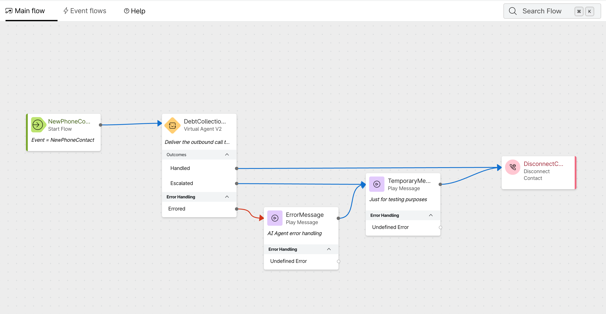
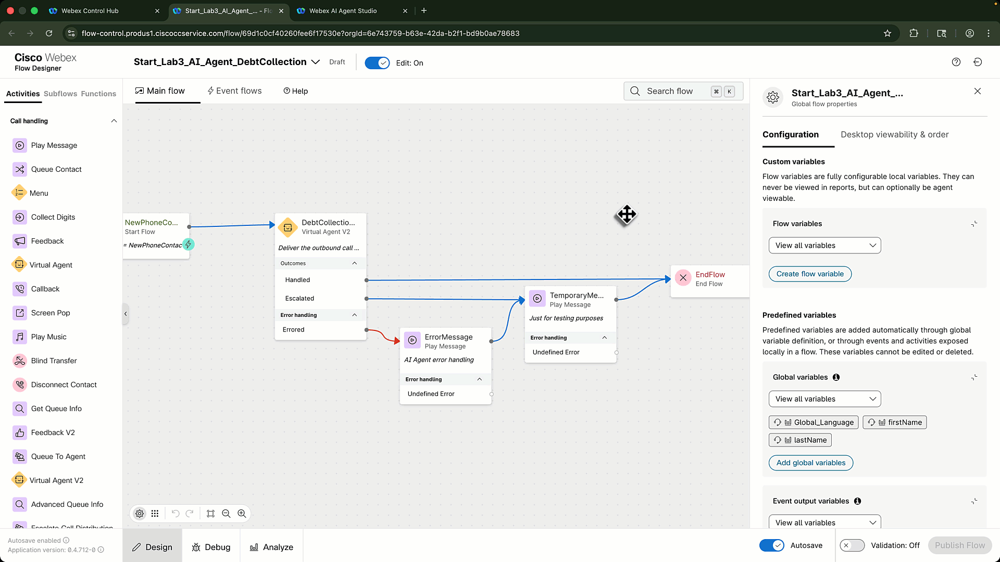
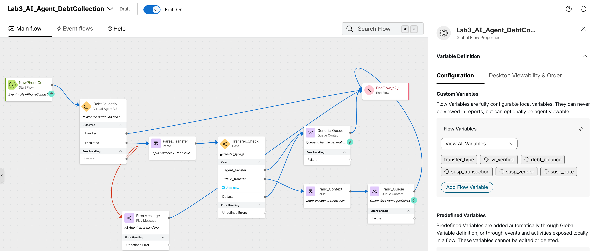
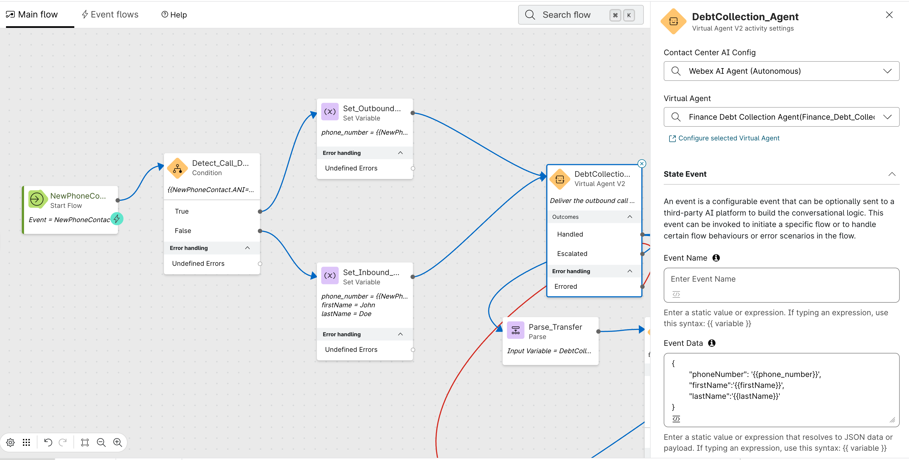
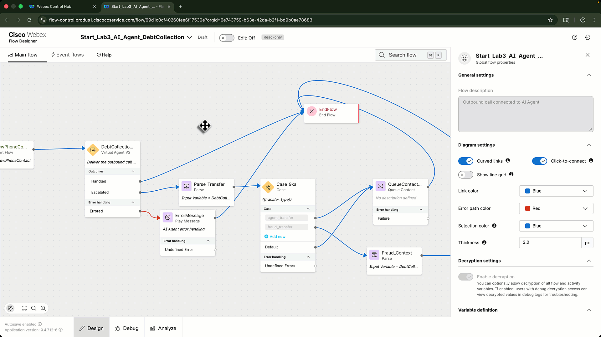
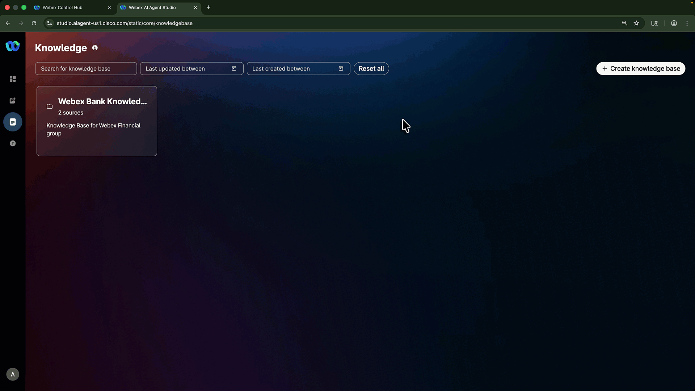
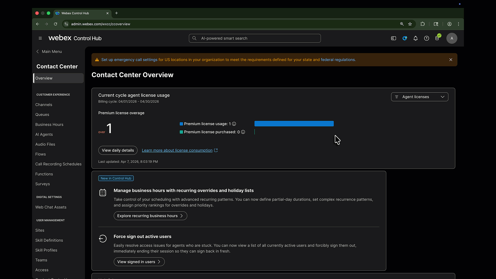

# Lab 3 - Real-Time Assist

## Lab Purpose

In Lab 2, you connected the outbound campaign to Alex, a Webex AI Agent. In this lab, you will add a human-assist path using **Webex Contact Center AI Assistant**, **Real-Time Transcription**, **Generated Summaries**, and **Real-Time Assist**.

This lab focuses on building the human-assist path and validating that the human agent receives useful guidance and can run the approved fraud-resolution actions during a live call.

???+ purpose "Lab Objectives"
    By the end of this lab, you will be able to:

    - Configure Alex to transfer fraud scenarios with context.
    - Route the human handoff and enable Real-Time Transcription in the flow.
    - Create a fraud Knowledge Base, then create a Real-Time Assist skill and configure its fulfillment actions.
    - Assign the skill to the Fraud Queue.
    - Create and assign a custom generated-summary template.
    - Update the routing flow on the POD-specific inbound entry point for direct testing.
    - Validate transcript, summary, and guidance during a human escalation scenario.

???+ challenge "Lab Outcome"
    A human agent receives the call after Alex escalates. The Agent Desktop shows Real-Time Transcript, AI Assistant guidance, and a generated summary.

---

## Pre-requisites

In order to complete this lab, you must have:

* [x] Completed [Lab 2 - AI Agent](lab2_debt_ai_agent.md).
* [x] The AI Assistant features have been enabled for the shared lab tenant.
* [x] The `fetch_transactions` and `open_case` Webex Connect flows are available in the lab tenant.

## Lab Overview

In this lab you will perform the following tasks:

1. Configure Alex to transfer fraud scenarios with context.
2. Configure the Fraud Queue and complete the handoff, transcription, and inbound test-path changes in Flow Designer.
3. Create a fraud Knowledge Base, then create the Real-Time Assist skill and configure its fulfillment actions.
4. Assign the skill to the queue.
5. Create and assign a custom generated-summary template.
6. Configure the inbound test path, update the pre-created inbound entry point, and test the assisted handoff.

---

## Lab 3.1 - Configure the Fraud Transfer

Lab 2 leaves the **Escalated** outcome on a temporary path. Create a native transfer action so Alex can hand the fraud scenario to a human agent with the relevant context.

???+ webex "Create the Transfer Action"
    1. Open Alex in **Webex AI Agent Studio** and select the **Actions** tab.
    2. Select **Add Actions** > **Transfer**.
    3. Use the following action details:

        | Field | Value |
        |---|---|
        | **Action name** | `fraud_transfer` |
        | **Description** | `Transfer the call to a fraud specialist when the customer reports a suspicious transaction.` |

    4. Add these input entities to carry the handoff context:

        | Entity | Type | Required | Description |
        |---|---|---|---|
        | `ivr_verified` | String | Yes | Whether the customer completed authentication. |
        | `debt_balance` | Number | No | Confirmed debt balance. |
        | `susp_transaction` | Number | No | Amount of the suspicious transaction. |
        | `susp_vendor` | String | No | Vendor for the suspicious transaction. |
        | `susp_date` | Date | No | Date of the suspicious transaction. |

    5. In Alex's instructions, add this escalation rule:

        ```text
        If fraud is suspected, retrieve recent transactions when needed and attempt to identify the suspicious transaction. Then use [fraud_transfer] to transfer the customer to a Fraud Specialist.
        ```

    6. Save and publish Alex.

    ???+ gif "Transfer Action Setup"
        <figure markdown>
        
        <figcaption>Transfer Action Configuration</figcaption>
        </figure>

---

## Lab 3.2 - Create the Fraud Queue and Route the Handoff

Lab 1.1 creates the team and Lab 1.2 creates an **outbound-only** queue. Create a separate inbound queue for the human escalation, using the team that contains your POD agent.

???+ webex "Create the Fraud Queue"
    1. In Collaboration Control Hub, navigate to **Contact Center** > **Queues**.
    2. Click **Create a queue** and configure:

        | Field | Value |
        |---|---|
        | **Name** | <copy>`PODXX_FraudQueue`</copy> |
        | **Contact direction** | `Inbound queue` |
        | **Channel type** | `Telephony` |
        | **Skills-based routing** | Disabled |
        | **Agent assignment** | `Teams` |
        | **Routing pattern** | `Longest available` |

    3. Under **Call distribution**, click **Create a group**.
    4. In **Group 1**, select the Lab 1 team that contains your POD agent.
    5. Complete the required queue settings, then create the queue.

    !!! note "Team Setup"
        Lab 1.1 creates the team. Before testing this lab, confirm that your POD agent is assigned to that team and is available in Agent Desktop.

---

## Lab 3.3 - Configure the AI Agent Flow

Make the Main Flow changes first, then configure Real-Time Transcription in **Event Flows** and publish once after the complete update.

???+ webex "Route Escalation to the Queue"
    1. Open the <copy>`PODXX_AI_Agent_DebtCollection`</copy> flow in **Collaboration Control Hub** > **Contact Center** > **Flows**. In the **Main Flow**, locate the **Virtual Agent V2** node used for Alex.

        ???+ inline end "Initial Flow View"
            <figure markdown>
            
            <figcaption>Initial flow before configuring the escalation path.</figcaption>
            </figure>

    2. In the **Activity Settings** panel for the Virtual Agent V2 node, scroll to **Output Variables**. The `MetaData` output contains the transfer-action details that you will map in the following steps.
    3. Open **Global Flow Properties**, create the following custom flow variables, and mark the agent-viewable context values as shown.

        | Variable | Type | Default value | Agent viewable | Desktop label |
        |---|---|---|---|---|
        | `transfer_type` | String | `agent_transfer` | No | N/A |
        | `ivr_verified` | String | `False` | Yes | `IVR Verified` |
        | `debt_balance` | Decimal | `0.0` | Yes | `Debt Balance` |
        | `susp_transaction` | Decimal | `0.0` | Yes | `Transaction Amount` |
        | `susp_vendor` | String | `Unknown` | Yes | `Transaction Vendor` |
        | `susp_date` | String | `N/A` | Yes | `Transaction Date` |

        ???+ gif "Create Flow Variables"
            <figure markdown>
            
            <figcaption>Creating the flow variables used to pass context to the human agent.</figcaption>
            </figure>

    4. Delete the temporary **Play Message** node connected to the **Escalated** outcome. Connect the existing error **Play Message** node directly to **End Flow**.
    5. Drag a **Parse** node onto the canvas, connect it to the **Escalated** path, name it <copy>`Parse_Transfer`</copy>, and use the description `Collects the transfer type.` Configure it to extract the transfer type from the Virtual Agent V2 metadata.

        | Setting | Value |
        |---|---|
        | **Input** | `DebtCollectionAgent.MetaData` |
        | **Content type** | JSON |
        | **Output variable** | `transfer_type` |
        | **Path** | `$.escalation_trigger` |

        !!! info "AI Agent Metadata"
            The `MetaData` output contains the actions and values collected during the AI Agent session. The `escalation_trigger` value identifies the transfer action that Alex used.

    6. Add a **Case** node, connect the output from **Parse_Transfer** to it, name it <copy>`Transfer_Check`</copy>, and use the description `Checks the transfer_type variable to route accordingly.` Configure these **Case** settings:

        | Setting | Value |
        |---|---|
        | **Variable** | `transfer_type` |
        | **Case 1** | `agent_transfer` |
        | **Case 2** | `fraud_transfer` |

    7. Add a **Queue Contact** node for the `agent_transfer` path, name it <copy>`Generic_Queue`</copy>, and select <copy>`PODXX_FraudQueue`</copy>. Connect the `agent_transfer` and default paths from **Transfer_Check** to this node, then connect its output to **End Flow**.
    8. Add a second **Parse** node named <copy>`Fraud_Context`</copy>. Connect the `fraud_transfer` path from **Transfer_Check** to this node. Use `DebtCollectionAgent.MetaData` as its input, set **Content type** to `JSON`, and map the `fraud_transfer` action input into the agent-viewable variables:

        | Output variable | JSON path |
        |---|---|
        | `ivr_verified` | `$.actions.fraud_transfer[0].input.ivr_verified` |
        | `debt_balance` | `$.actions.fraud_transfer[0].input.debt_balance` |
        | `susp_transaction` | `$.actions.fraud_transfer[0].input.susp_transaction` |
        | `susp_vendor` | `$.actions.fraud_transfer[0].input.susp_vendor` |
        | `susp_date` | `$.actions.fraud_transfer[0].input.susp_date` |

    9. Add a **Queue Contact** node named <copy>`Fraud_Queue`</copy>, select <copy>`PODXX_FraudQueue`</copy>, and connect the output from **Fraud_Context** to it. Connect the output from **Fraud_Queue** to **End Flow**.

        ???+ inline end "Final Flow View"
            <figure markdown>
            
            <figcaption>Final flow with context extraction and queue routing configured.</figcaption>
            </figure>

        ???+ gif "Extract AI Agent Context"
            <figure markdown>
            
            <figcaption>Configuring the escalation path and extracting AI Agent context.</figcaption>
            </figure>

???+ webex "Add the Inbound Test Path"
    Use the same flow for campaign and inbound calls, so testing does not depend on waiting for Campaign Manager. If the ANI matches the campaign outdial number, the call is outbound and the flow sends the customer's DNIS to Alex. Otherwise, the call is inbound and the flow sends the caller's ANI.

    1. In <copy>`PODXX_AI_Agent_DebtCollection`</copy>, click **Global Flow Properties**.
    2. Under **Custom Flow Variables**, create this variable:

        | Variable name | Type | Default value |
        |---|---|---|
        | `phone_number` | `String` | *(empty)* |

    3. On the canvas, drag a **Condition** node immediately after the **New Contact** start node.
    4. Rename the node <copy>`Detect_Call_Direction`</copy> and configure this expression:

        <copy>`{{NewContact.ANI=="+17382033500"}}`</copy>

        This is the outdial ANI configured for the campaign. A matching ANI follows the outbound path.

    5. Configure the **True** path for outbound calls:

        - Add a **Set Variable** node and connect it to the **True** output.
        - Name it <copy>`Set_Outbound_Phone`</copy>.
        - Set `phone_number` to `{{NewContact.DNIS}}`.

    6. Configure the **False** path for inbound calls:

        ???+ inline end "Inbound Test Flow"
            <figure markdown>
            
            <figcaption>Complete inbound and outbound call-direction flow.</figcaption>
            </figure>

        - Add a **Set Variable** node and connect it to the **False** output.
        - Name it <copy>`Set_Inbound_Phone`</copy>.
        - Set the following variables:

            | Variable | Set value |
            |---|---|
            | `phone_number` | `{{NewContact.ANI}}` |
            | `firstName` | First name of your test customer from Lab Prework |
            | `lastName` | Last name of your test customer from Lab Prework |

    7. Connect both **Set Variable** nodes to the existing **Virtual Agent V2** node (`DebtCollectionAgent`).
    8. In the **State Event** data for that node, use:

        ```json
        {
          "phoneNumber": "{{phone_number}}",
          "firstName": "{{firstName}}",
          "lastName": "{{lastName}}"
        }
        ```

???+ webex "Configure Real-Time Transcription"
    Real-Time Transcription requires media streaming to start when the human agent accepts the call.

    1. Go to **Event Flows**.
    2. Drag a **Start Media Stream** node onto the canvas.
    3. Connect the **AgentAnswered** event node to **Start Media Stream**.

        !!! info "Event Name"
            In some tenants, **AgentAnswered** appears as **AgentAccepted**. Use the event that is available in your Flow Designer.

    4. Connect **Start Media Stream** to **End Flow**.
    5. Validate and publish the flow.

    ???+ gif "Configure RTT in Event Flows"
        <figure markdown>
        
        <figcaption>Real-Time Transcription flow configuration</figcaption>
        </figure>

---

## Lab 3.4 - Create the Real-Time Assist Skill

???+ webex "Create the Fraud Knowledge Base"
    Create a dedicated Knowledge Base for your RTA skill. A Knowledge Base can be associated with only one AI Assistant skill, so do not select a Knowledge Base already in use by another attendee's skill.

    !!! download "Knowledge Base document"
        [Download `Fraud_KB.docx`](./bcamp_files/Fraud_KB.docx){:download="Fraud_KB.docx"}.

    1. In **Webex AI Agent Studio**, select **Knowledge** in the left navigation.
    2. Click **Create Knowledge Base**.
    3. Enter <copy>`Fraud_KB`</copy> as the name and provide a brief description.
    4. Select **Add source** > **Files**, then upload the downloaded `Fraud_KB.docx` document.
    5. Click **Process Files**. You can select **Close and keep processing** while the file is processed.
    6. Wait until the source status is **Processed** before creating the RTA skill.

    ???+ gif "Configure Fraud Knowledge Base"
        <figure markdown>
        
        <figcaption>Creating and processing the Fraud Knowledge Base.</figcaption>
        </figure>

???+ webex "Create the RTA Skill"
    1. Open **Webex AI Agent Studio** from Collaboration Control Hub.
    2. Select the **AI Assistant Skill** icon in the left navigation.
    3. Click **+ Create Skill**, select **Start from scratch**, then click **Next**.
    4. Use the following values:

        | Field | Value |
        |---|---|
        | **Skill name** | <copy>`PODXX_RTA_Assistant`</copy> |
        | **Goal** | <copy>`You are an ai assistant working for Webex Financial Group. You will be assisting human agents that are specialized in handling fraud scenarios for our customers. Provide timely recommendations about our fraud prevention and dispute transaction policies.`</copy> |

    5. Add or confirm the instructions:

        ```text
        # AI Assistant Action Orchestration

        Before asking the AGENT to collect any data from the CUSTOMER, check the conversation history. If the data was already provided, reuse it instead of asking again.
        If the AGENT has acknowledged the CUSTOMER's intent but has not yet asked for the specific required data, do not repeat or pre-empt the suggestion. Allow the conversation to progress.
        When calling tools: Use ONLY values the customer explicitly provided. NEVER infer, construct, extract digits from other fields, use example values, add UNKNOWN or use default/placeholder values (like "00:00", "0", etc.). Missing required parameter = ASK user. Missing optional parameter = OMIT it entirely. NO exceptions.

        The CustomerID format is CUST-001, agent only needs to collect the last 3 digits.

        ## Collect Recent Transactions

        **Always follow these instructions before moving to the "Identify Fraudulent Transaction" section.**

        1. **Fetch Recent Transactions**: Ask the AGENT to get the CUSTOMER ID at the beginning of the call. Use the CUSTOMER ID to execute [fetch_transactions] action to get the recent transactions.
        2. **Provide Transaction Details**: Once transactions are fetched, provide the AGENT with the following details for each transaction:
           - Transaction Amount
           - Transaction Vendor
           - Transaction City
           - Transaction Date
        3. **Error Handling**: If there are no transactions available, instruct the AGENT to check the banking system manually. If the banking system is unresponsive, advise the agent to escalate the issue.

        ## Identify Fraudulent Transaction

        1. **Guide the AGENT**: Confirm if the transaction identified as suspicious could have been made by someone else with access to the account or if the CUSTOMER recognizes the amount but not the vendor. Prompt the agent to ask the customer if they have any recent transactions that they do recognize.
        2. **CUSTOMER confirms the transaction is fraudulent**: Explain to the AGENT that they need to open a dispute case to investigate the transaction. Guide the agent to inform the customer that opening the case will automatically lock the CUSTOMER's credit card and ship a new one to the address on file. The AGENT needs to get confirmation from the CUSTOMER before the case is opened.
        3. **Once the CUSTOMER confirms**: Execute the [open_case] action. **If the CUSTOMER declines**: If the CUSTOMER has a reason to decline their card getting locked, guide the agent to ask them to provide a reason and look for alternative options. Shipment of the credit card can be expedited from 5 days to 2 days in case of travel or other time sensitive activities.
        4. **Provide Case ID**: Once the case is opened, provide the AGENT with the case ID that is returned by the action. Guide the agent to share the case ID to the customer and explain it's important to keep track of their dispute.

        ### Additional Considerations

        - **User Experience**: Ensure that the language used is empathetic and supportive, as customers may be distressed about potential fraud.
        ```

    6. Attach the `Fraud_KB` Knowledge Base you just created.

        !!! note
            Select the Knowledge Base that you created for this skill. Do not attach a Knowledge Base already associated with another AI Assistant skill.

???+ webex "Configure Fulfillment Actions"
    Create two actions in the skill and associate each with its matching Webex Connect flow. Do not open or modify Webex Connect.

    1. In the skill, open the **Actions** tab and select **+ New Action**.
    2. Create the `fetch_transactions` action:

        | Field | Value |
        |---|---|
        | **Action name** | `fetch_transactions` |
        | **Description** | `Retrieve recent account transactions using the confirmed Customer ID.` |
        | **Action scope** | `Slot filling and fulfillment` |

    3. Add one required input entity:

        | Entity | Type | Value | Agent review |
        |---|---|---|---|
        | `CustomerID` | `Regex` | `CUST-\d{3}` | `Yes` |

    4. In the **Webex Connect Flow Builder Fulfillment** section, select the <copy>`LAB_31207`</copy> service and the `fetch_transactions` flow. Save the action.
    5. Create the `open_case` action:

        | Field | Value |
        |---|---|
        | **Action name** | `open_case` |
        | **Description** | `Open a fraud case for a confirmed Customer ID and disputed Transaction ID.` |
        | **Action scope** | `Slot filling and fulfillment` |

    6. Add the following required input entities. Select **Agent review** for both, so the human agent verifies the case details before the action runs.

        | Entity | Type | Description |
        |---|---|---|
        | `CustomerID` | `Regex` (`CUST-\d{3}`) | Confirmed customer identifier. |
        | `TransactionID` | `String` | Identifier returned by `fetch_transactions`; do not ask the customer for it. |

    7. Select the <copy>`LAB_31207`</copy> service and the `open_case` flow, then save the action.
    8. Publish the skill.

    !!! tip "Action Design"
        Use a precise entity description and an example for each predictable value. A fulfillment action that opens a case should always be reviewed by the human agent before execution. The case action returns either its Case ID or its completion result to the AI Assistant; attendees do not need access to Airtable to validate it.

    ???+ gif "AI Assistant Skill Configuration"
        <figure markdown>
        
        <figcaption>Creating the AI Assistant skill and its fulfillment actions.</figcaption>
        </figure>

---

## Lab 3.5 - Assign the Skill to the Queue

???+ webex "Assign RTA Skill"
    1. Go to **Collaboration Control Hub** > **Contact Center** > **AI Features**.
    2. Open the **Queue** tab.
    3. Select <copy>`PODXX_FraudQueue`</copy>.
    4. In the **Real-Time Assist** section, enable **Apply Real-Time Assist**.
    5. Select <copy>`PODXX_RTA_Assistant`</copy>.
    6. Save the queue configuration.

    ???+ gif "Assign Skill to Queue"
        <figure markdown>
        
        <figcaption>Assigning an AI Assistant skill to the fraud queue.</figcaption>
        </figure>

???+ info "Skill-to-Queue Mapping"
    RTA skills are assigned to queues. Any agent receiving a call from the assigned queue should receive the skill's guidance for that interaction.

---

## Lab 3.6 - Create a Custom Generated-Summary Template

Custom Templates let you tailor the post-call summary to the fraud-handoff workflow.

???+ webex "Create and Publish the Template"
    1. In **Webex AI Agent Studio**, open **Summary Templates**.
    2. Select **Create Template** and name it <copy>`PODXX_Fraud_Handoff_Summary`</copy>.
    3. In **Configuration summary**, keep **Initial contact reason** and **Next steps** enabled. Disable **Key actions taken** and **Additional context**.
    4. Add two **New custom section** entries. For each entry, complete **Title** and **Instructions**; leave **Example (optional)** blank.

        | Title | Instructions |
        |---|---|
        | **Financial account details** | Capture the confirmed balance, payment intent, and payment outcome when discussed. |
        | **Fraud case details** | Capture the disputed transaction's amount, vendor, and date, plus the returned Case ID or result when a case is opened. |

    5. Use the preview/test experience with a sample conversation. Confirm each section is populated clearly and does not invent missing details.
    6. Publish the template.
    7. In **Collaboration Control Hub**, navigate to **Contact Center** > **AI Features**, open the **Queue** tab, and select <copy>`PODXX_FraudQueue`</copy>.
    8. In **Generated Summaries**, enable summaries for the queue. In the **Templates** dropdown, select <copy>`PODXX_Fraud_Handoff_Summary`</copy>, then save the queue configuration.

---

## Lab 3.7 - Configure the Pre-Created Inbound Entry Point

Each POD already has an inbound telephony entry point and assigned inbound DN. Do not create a new entry point.

???+ webex "Update the Inbound Entry Point Routing"
    1. In Collaboration Control Hub, navigate to **Contact Center** > **Channels** > **Entry Points**.
    2. Find and open your pre-created inbound entry point: <copy>`Inbound_EP_<yourpodnumber>`</copy>.
    3. In **Routing flow**, replace <copy>`To_be_replaced`</copy> with your published <copy>`PODXX_AI_Agent_DebtCollection`</copy> flow. Select the **Latest** version label.
    4. Save the entry point.

    !!! important "Keep the Pre-Created Inbound Settings"
        Do not change the entry point name, inbound DN, channel type, timezone, music on hold, or any other pre-created setting. Only replace the **Routing flow** value.

---

## Lab 3.8 - Test RTA

???+ webex "Execute the Test"
    1. Place a call to the inbound DN already assigned to your POD's entry point, or start the outbound call from Campaign Manager.
    2. Complete Alex's authentication flow, then ask to review your recent transactions. When Alex presents them, trigger the escalation path by saying:

        <copy>`I don't recognize that transaction.`</copy>

    3. Confirm that Alex collects the suspicious transaction details and transfers the call to the fraud specialist.
    4. Accept the call as the human agent.
    5. Confirm the Agent Desktop shows:

        | Feature | Expected Result |
        |---|---|
        | Real-Time Transcript | Live transcript appears after the agent accepts the call. |
        | AI Assistant | Guidance appears during the conversation. |
        | RTA Skill | Guidance matches the dispute/fraud scenario. |
        | Fulfillment actions | The agent can review and run the configured `fetch_transactions` and `open_case` actions when the conversation requires them. |
        | Generated Summary | Summary appears in the wrap-up panel after call completion. |

    6. End the call and review the generated summary.

???+ tip "Suggested Test Conversation"
    Use this conversation after the call reaches the human agent to exercise the RTA guidance and fulfillment actions. Adapt the transaction details to the information Alex and the customer already discussed.

    1. As the human agent, acknowledge the concern and say: <copy>`I can help with that. Let me review the recent transactions with you.`</copy>
    2. Review the `fetch_transactions` recommendation, confirm the Customer ID when prompted, and run the action.
    3. Confirm the disputed transaction with the customer by restating its amount, merchant, and date. Then ask: <copy>`Would you like me to open a fraud case for this transaction?`</copy>
    4. After the customer agrees, review the `open_case` recommendation, confirm the Customer ID and Transaction ID, and run the action.
    5. Share the returned Case ID or completion result with the customer, then end the call and inspect the generated summary.

???+ failure "Troubleshooting"
    - **No transcript**: Confirm **Start Media Stream** is connected from **AgentAnswered** or **AgentAccepted**.
    - **No RTA guidance**: Confirm the skill is published and assigned to the queue receiving the call.
    - **Fulfillment action is unavailable**: Confirm the corresponding Webex Connect flow is live and selected in the action configuration.

---

## Lab Completion

At this point, you have successfully:

- [x] Created the `fraud_transfer` action and routed its context to the human agent.
    - [x] Created the POD-specific Fraud Queue.
    - [x] Confirmed the flow can start media streaming for RTT.
    - [x] Created the `Fraud_KB` Knowledge Base and associated it with the RTA skill.
    - [x] Created an RTA skill and configured its fulfillment actions.
- [x] Assigned the skill to the queue.
- [x] Created and assigned a custom generated-summary template.
- [x] Updated the routing flow on the POD-specific pre-created inbound entry point for direct testing.
- [x] Tested human-agent guidance and the fulfillment actions during the escalation scenario.

**Congratulations!** You have completed the LAB-31207 core journey: native Campaign Manager to AI Agent, with Real-Time Assist for the human handoff.
